# CloudLens OpenShift Visibility Lab Guide

### Complete walkthrough: AWS + Red Hat setup, infrastructure deployment, Keysight product configuration, and hands-on lab exercises

This lab teaches you to deploy and operate **Keysight CloudLens** for OpenShift network visibility on AWS. You'll provision a **ROSA HCP** (Red Hat OpenShift Service on AWS — Hosted Control Planes) cluster, install CloudLens sensors, configure traffic tapping through **Keysight Vision One (KVO)**, and forward mirrored traffic through a **Virtual Packet Broker (vPB)** to analysis tools like Wireshark and tcpdump.

> Parallel to the [cloudlens-k8s-lab](https://github.com/Keysight-Tech/cloudlens-k8s-lab) (EKS version) — same Keysight product stack, fully adapted for OpenShift/ROSA.

---

## Table of Contents

- [Architecture Diagram](#architecture-diagram)
- **Part 1: Prerequisites**
  - [1.1 AWS Marketplace Subscriptions](#11-aws-marketplace-subscriptions)
  - [1.2 Create an EC2 Key Pair](#12-create-an-ec2-key-pair)
  - [1.3 Red Hat Account & ROSA Setup](#13-red-hat-account--rosa-setup)
  - [1.4 Check AWS Service Quotas](#14-check-aws-service-quotas)
  - [1.5 Configure AWS CLI](#15-configure-aws-cli)
  - [1.6 Install Terraform](#16-install-terraform)
  - [1.7 Install Other Required Tools](#17-install-other-required-tools)
- **Part 2: Deploy the Lab**
  - [2.1 Clone and Configure](#21-clone-and-configure)
  - [2.2 Deploy with Terraform](#22-deploy-with-terraform)
  - [2.3 Wait for Initialization](#23-wait-for-initialization)
  - [2.4 Configure oc for ROSA](#24-configure-oc-for-rosa)
  - [2.5 Deploy Sample Applications to OpenShift](#25-deploy-sample-applications-to-openshift)
- **Part 3: Keysight Product Setup**
  - [3.1 Log In to CLMS](#31-log-in-to-clms-cloudlens-manager)
  - [3.2 Create KVO User on CLMS](#32-create-kvo-user-on-clms)
  - [3.3 Log In to KVO](#33-log-in-to-kvo-keysight-vision-one)
  - [3.4 Register CLMS in KVO Inventory](#34-register-clms-in-kvo-inventory)
  - [3.5 Activate Licenses](#35-activate-licenses)
  - [3.6 Connect to vPB](#36-connect-to-vpb-virtual-packet-broker)
  - [3.7 Activate CyPerf License](#37-activate-cyperf-license)
- **Part 4: Lab Exercises**
  - [Exercise 1: CloudLens Sensor Sidecar on OpenShift](#exercise-1-cloudlens-sensor-sidecar-on-openshift)
  - [Exercise 2: KVO Visibility Configuration](#exercise-2-kvo-visibility-configuration)
  - [Exercise 3: Verify Mirrored Traffic](#exercise-3-verify-mirrored-traffic-on-tool-vms)
  - [Exercise 4: vPB Traffic Forwarding](#exercise-4-vpb-traffic-forwarding)
  - [Exercise 5: CyPerf Traffic Generation (Advanced)](#exercise-5-cyperf-traffic-generation-advanced)
- **Part 5: Reference**
  - [Troubleshooting](#troubleshooting)
  - [Cost Management](#cost-management)
  - [Uninstall / Cleanup](#uninstall--cleanup)
  - [Lab Environment Summary](#lab-environment-summary)
  - [SSH Quick Reference](#ssh-quick-reference)

---

## Architecture Diagram

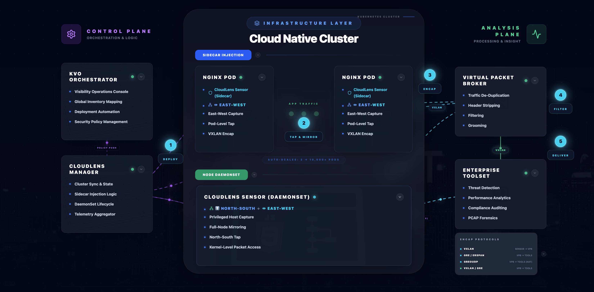

**Traffic Flow:**
1. **Deploy** — KVO pushes monitoring policies to CloudLens Manager
2. **Tap & Mirror** — CloudLens sensor sidecar captures pod traffic (North-South + East-West) via OVN-Kubernetes CNI
3. **Encap** — Mirrored traffic is VXLAN-encapsulated and sent across the VPC to the analysis plane
4. **Filter** — Virtual Packet Broker performs traffic de-duplication, header stripping, and filtering
5. **Deliver** — Filtered traffic is forwarded via VXLAN/GRE to enterprise tools (Wireshark, tcpdump, threat detection)

**Key OpenShift differences vs EKS:**

| Feature | EKS | OpenShift (ROSA) |
|---------|-----|-----------------|
| CNI | AWS VPC CNI | OVN-Kubernetes |
| CLI | `kubectl` | `oc` (superset of kubectl) |
| Container security | Flexible | SCC enforcement |
| nginx image | `nginx:latest` (port 80) | `bitnami/nginx` (port 8080, non-root) |
| External access | LoadBalancer Service | OpenShift Route |
| Cluster login | `aws eks update-kubeconfig` | `oc login` + htpasswd IDP |
| Container runtime | containerd | CRI-O (RHCOS) |

---

# Part 1: Prerequisites

## 1.1 AWS Marketplace Subscriptions

Before deploying, ensure you have the following:

- **Keysight Product License Activation Codes** for:
  - **KVO** (VisionOrchestrator perpetual license)
  - **CloudLens** (CloudLens Enterprise Edition subscription)
  - **CyPerf** (if deploying CyPerf traffic generator)

> **Important:** Each SE must have their own license activation codes. Contact your Keysight representative or SE manager to obtain them **before** starting the lab.

- **AWS Marketplace subscriptions** for these Keysight products:
  - [CloudLens Manager (CLMS)](https://aws.amazon.com/marketplace) — Network visibility management
  - [Keysight Vision One (KVO)](https://aws.amazon.com/marketplace) — Network packet broker
  - [Virtual Packet Broker (vPB)](https://aws.amazon.com/marketplace) — Traffic monitoring appliance

> **How to subscribe:** Go to AWS Marketplace, search for each product, click "Continue to Subscribe", then "Accept Terms". No charges until you launch instances.

### Step 1: Navigate to AWS Marketplace

Open the AWS Console and search for **"AWS Marketplace"** in the search bar.

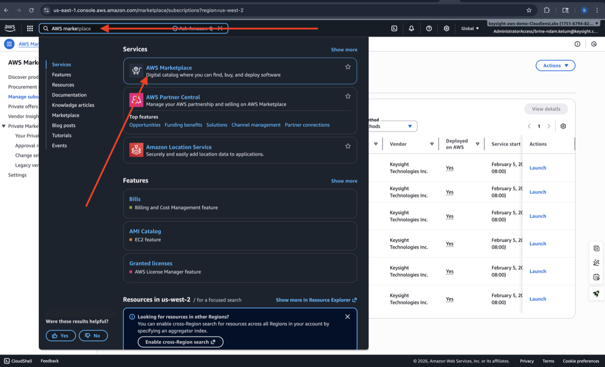

### Step 2: Search for Keysight CloudLens

In the Marketplace, click **"Discover products"** and search for **"Keysight CloudLens"**.

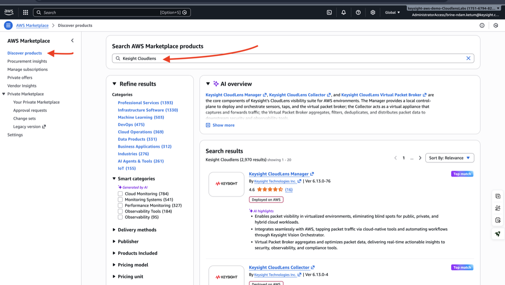

### Step 3: Subscribe to CloudLens Manager

Click on **Keysight CloudLens Manager**, then click **"View purchase options"** > **"Continue to Subscribe"** > **"Accept Terms"**.

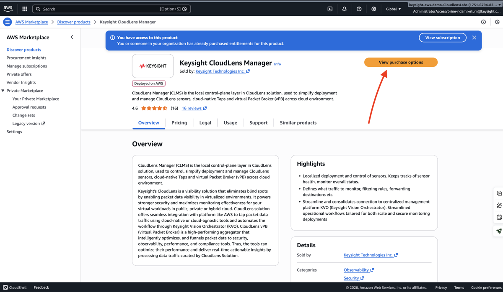


### Step 4: Verify All Subscriptions

Repeat for KVO and vPB. Go to **"Manage subscriptions"** to verify all products show **Active** status.

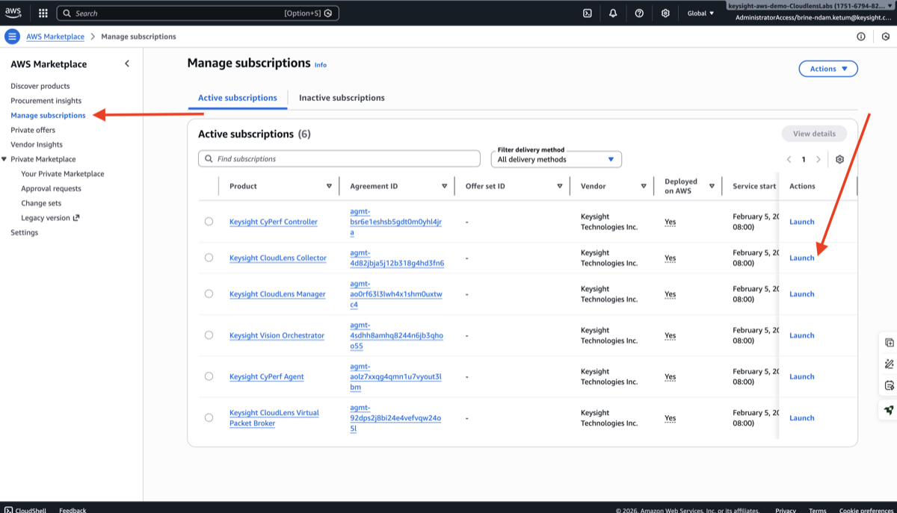

---

## 1.2 Create an EC2 Key Pair

An EC2 key pair is required for SSH access to all Linux VMs in your lab (CLMS, vPB, Ubuntu workload, and tool VMs). Without it, you won't be able to connect to any of your lab instances.

### Step 1: Navigate to Key Pairs

In the AWS Console, go to **EC2** > **Network & Security** > **Key Pairs** in the left sidebar.

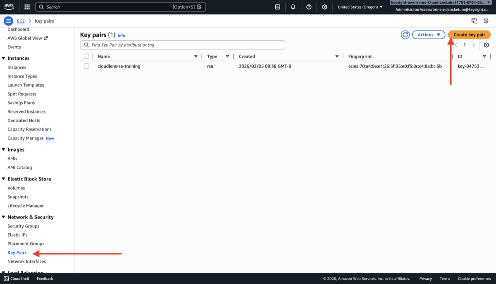

### Step 2: Create the Key Pair

Click **Create key pair** (orange button, top right) and configure:

| Setting | Value |
|---------|-------|
| **Name** | `cloudlens-lab` (or any name you'll remember) |
| **Key pair type** | **RSA** |
| **Private key file format** | **.pem** (macOS/Linux) or **.ppk** (PuTTY on Windows) |

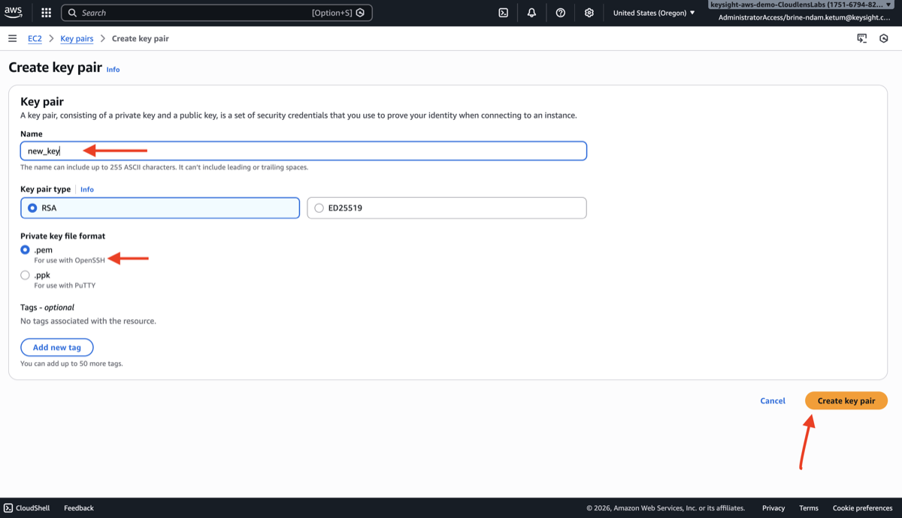

Click **Create key pair**. The `.pem` file will **download automatically to your browser's Downloads folder**.

> **IMPORTANT:** This is the **only time** you can download this private key. AWS does not store it. If you lose it, you must create a new key pair. Save it somewhere safe.

### Step 3: Set Key Permissions

```bash
# Move it to a known location
mv ~/Downloads/cloudlens-lab.pem ~/.ssh/

# Restrict permissions (required for SSH to accept it)
chmod 400 ~/.ssh/cloudlens-lab.pem
```

---

## 1.3 Red Hat Account & ROSA Setup

ROSA requires a Red Hat account with OpenShift Service on AWS enabled. This is a one-time setup.

### Step 1: Create a Red Hat Account

If you don't have one, register at [console.redhat.com](https://console.redhat.com).

### Step 2: Enable ROSA on your AWS Account

1. Go to [console.redhat.com/openshift/overview/rosa](https://console.redhat.com/openshift/overview/rosa)
2. Click **"Enable ROSA"**
3. Follow the prompts to link your AWS account to Red Hat

### Step 3: Get your OCM API Token

The OCM (OpenShift Cluster Manager) token authenticates Terraform's `rhcs` provider to create ROSA clusters.

1. Go to [console.redhat.com/openshift/token](https://console.redhat.com/openshift/token)
2. Click **"Load token"**
3. Copy the token — you'll paste it into `terraform.tfvars` as `rhcs_token`

> **Token expiry:** OCM tokens expire after 30 days of inactivity. If Terraform fails with an auth error, refresh your token at the same URL.

### Step 4: Create ROSA Account Roles (once per AWS account)

ROSA requires IAM roles before the first cluster can be created. This is a one-time operation per AWS account:

```bash
# Install rosa CLI (if not installed — see section 1.7)
rosa login --token "<your-ocm-token>"

# Create account roles (HCP = Hosted Control Planes)
rosa create account-roles \
  --hosted-cp \
  --mode auto \
  --yes \
  --region us-west-2

# Verify
rosa list account-roles | grep HCP-ROSA
```

> Terraform will also run this automatically (idempotent), but pre-creating roles speeds up `terraform apply`.

### Step 5: Verify ROSA Quotas

```bash
rosa verify quota --region us-west-2
rosa verify permissions --region us-west-2
```

Both commands should show no errors. If quota issues are reported, open an AWS Support case to request increases.

---

## 1.4 Check AWS Service Quotas

Your lab requires these resources. Request increases if needed:

| Resource | Required | Check Command |
|----------|----------|---------------|
| Elastic IPs | 7+ | `aws service-quotas get-service-quota --service-code ec2 --quota-code L-0263D0A3` |
| vCPUs (on-demand) | ~30 | `aws service-quotas get-service-quota --service-code ec2 --quota-code L-1216C47A` |
| VPCs | 1 | Usually 5 per region (default) |
| ROSA worker nodes | 2+ | Verify via `rosa verify quota` |

> **Tip:** Service quota increases are free but may take up to 24 hours. Request them before deploying.

---

## 1.5 Configure AWS CLI

```bash
# Install AWS CLI (if not installed)
brew install awscli          # macOS
# or: pip install awscli     # Linux/Windows

# Configure a named profile
aws configure --profile cloudlens-lab
# Enter: Access Key ID, Secret Access Key, Region (us-west-2), Output format (json)

# Verify
aws sts get-caller-identity --profile cloudlens-lab
```

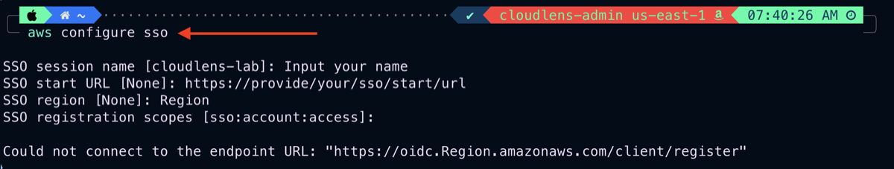

---

## 1.6 Install Terraform

Terraform provisions all the AWS + ROSA infrastructure for this lab.

```bash
# macOS
brew install terraform

# Linux
sudo apt-get update && sudo apt-get install -y terraform
# or: https://developer.hashicorp.com/terraform/install

# Verify installation
terraform version
# Requires: >= 1.5
```

---

## 1.7 Install Other Required Tools

| Tool | Purpose | Install (macOS) | Verify |
|------|---------|----------------|--------|
| **oc** | OpenShift CLI (superset of kubectl) | `brew install openshift-cli` | `oc version` |
| **rosa** | ROSA cluster management | See below | `rosa version` |
| **jq** | JSON parsing | `brew install jq` | `jq --version` |
| **Python 3** | CyPerf API scripts | `brew install python3` | `python3 --version` |

**Install rosa CLI:**

```bash
# macOS
curl -sL https://mirror.openshift.com/pub/openshift-v4/clients/rosa/latest/rosa-macosx.tar.gz \
  | tar xz -C /usr/local/bin
chmod +x /usr/local/bin/rosa
rosa version

# Linux
curl -sL https://mirror.openshift.com/pub/openshift-v4/clients/rosa/latest/rosa-linux.tar.gz \
  | tar xz -C /usr/local/bin
chmod +x /usr/local/bin/rosa
```

**Install oc CLI:**

```bash
# macOS
brew install openshift-cli

# Linux
curl -sL https://mirror.openshift.com/pub/openshift-v4/clients/ocp/stable/openshift-client-linux.tar.gz \
  | tar xz -C /usr/local/bin oc kubectl
```

> `oc` is a full superset of `kubectl` — all `kubectl` commands work with `oc`. Use `oc` for OpenShift-specific features (Routes, SCCs, Projects).

---

# Part 2: Deploy the Lab

## 2.1 Clone and Configure

```bash
# Clone the repo
git clone https://github.com/Keysight-Tech/cloudlens-openshift-lab.git
cd cloudlens-openshift-lab

# Create your configuration file
cp terraform/terraform.tfvars.example terraform/terraform.tfvars
```

Edit `terraform/terraform.tfvars` with your values:

```hcl
# Required — match your AWS setup from Part 1
aws_profile   = "cloudlens-lab"
aws_region    = "us-west-2"
key_pair_name = "cloudlens-lab"

# Required — from console.redhat.com/openshift/token
rhcs_token = "eyJhbGciOiJSUzI1NiJ9..."

# Personalize
deployment_prefix = "cloudlens-lab"
owner             = "your-name"

# Features
vpb_enabled     = true
rosa_enabled    = true
use_elastic_ips = true
cyperf_enabled  = true   # set false to skip CyPerf
```

---

## 2.2 Deploy with Terraform

**Option A — Fully automated (recommended):**

```bash
chmod +x scripts/*.sh
./scripts/deploy.sh
```

The script handles all steps: validates prerequisites, runs Terraform, waits for ROSA readiness, logs in via `oc`, deploys workloads, and optionally deploys CyPerf.

**Option B — Manual Terraform:**

```bash
cd terraform

# Initialize (downloads providers including terraform-redhat/rhcs)
terraform init

# Preview what will be created
terraform plan

# Deploy everything (type 'yes' when prompted)
terraform apply
```

> **Deployment takes ~25-35 minutes.** The ROSA HCP cluster takes 15-20 minutes to provision. EC2 instances and VPC are created in parallel.

### What gets deployed

After `terraform apply` completes, you'll see outputs like:

```
clms_url                    = "https://54.xx.xx.xx"
kvo_url                     = "https://35.xx.xx.xx"
vpb_public_ip               = "52.xx.xx.xx"
ubuntu_public_ip            = "34.xx.xx.xx"
windows_public_ip           = "44.xx.xx.xx"
tool_linux_public_ip        = "54.xx.xx.xx"
tool_windows_public_ip      = "35.xx.xx.xx"
rosa_cluster_name           = "cloudlens-lab-rosa"
rosa_console_url            = "https://console-openshift-console.apps.cloudlens-lab-rosa..."
rosa_login_command          = "oc login https://api.cloudlens-lab-rosa... --username cluster-admin ..."
cyperf_controller_ui_url    = "https://54.xx.xx.xx"
```

**Save these outputs** — you'll need them throughout the lab. Run `terraform output` at any time to see them again.

---

## 2.3 Wait for Initialization

Products need time to fully boot after instances and the cluster launch:

| Product | Wait Time | How to Check |
|---------|-----------|-------------|
| **CLMS** | ~15 minutes | Browse to `https://<CLMS_IP>` — login page appears |
| **KVO** | ~15 minutes | Browse to `https://<KVO_IP>` — login page appears |
| **vPB** | ~5-10 minutes | `ssh admin@<VPB_IP>` succeeds |
| **ROSA cluster** | ~15-20 minutes | `rosa describe cluster -c cloudlens-lab-rosa` shows `State: ready` |

```bash
# Monitor ROSA cluster state
rosa describe cluster -c $(terraform output -raw rosa_cluster_name)

# Watch for "State: ready"
rosa logs install -c $(terraform output -raw rosa_cluster_name) --tail 20
```

---

## 2.4 Configure oc for ROSA

Unlike EKS (which uses `aws eks update-kubeconfig`), ROSA uses `oc login` with a username/password or token. Terraform auto-creates a `cluster-admin` user via htpasswd identity provider.

```bash
# Get the login command (generated by Terraform)
terraform output -raw rosa_login_command

# Run it — looks like:
oc login https://api.cloudlens-lab-rosa.xxxx.openshiftapps.com:443 \
  --username cluster-admin \
  --password <generated-password> \
  --insecure-skip-tls-verify

# Or use the one-liner:
eval "$(terraform output -raw rosa_login_command)"

# Verify connection
oc whoami
oc get nodes
oc get pods -A
```


> **Note:** `oc` is a superset of `kubectl` — all kubectl commands work identically. Use `oc` throughout this lab for OpenShift-specific features (Routes, SCCs, Projects).

---

## 2.5 Deploy Sample Applications to OpenShift

Deploy nginx as a sample workload that CloudLens will monitor. OpenShift requires `bitnami/nginx` (runs non-root on port 8080) instead of standard `nginx:latest` (which requires root and is blocked by OpenShift's default SCC).

```bash
# Grant privileged SCC to cloudlens-sensor ServiceAccount
# (Required for the CloudLens sensor sidecar)
oc create serviceaccount cloudlens-sensor -n default
oc adm policy add-scc-to-user privileged -z cloudlens-sensor -n default

# Get CLMS private IP for sensor config
CLMS_IP=$(terraform output -raw clms_private_ip)
PREFIX=$(terraform output -raw deployment_prefix)

# Deploy with CLMS IP substituted
sed -e "s|REPLACE_WITH_CLMS_PRIVATE_IP|${CLMS_IP}|g" \
    -e "s|REPLACE_WITH_CLMS_PROJECT_KEY|REPLACE_WITH_YOUR_PROJECT_KEY|g" \
    -e "s|REPLACE_WITH_DEPLOYMENT_PREFIX|${PREFIX}|g" \
    kubernetes_manifests/nginx-openshift-deployment.yaml | oc apply -f -

# Verify pods are running (each pod has 2 containers: nginx + cloudlens-sensor)
oc get pods -n default
oc get pods -n default -o wide

# Check the OpenShift Route (equivalent to LoadBalancer in EKS)
oc get route nginx-demo -n default
```

Once the Route is ready, test it:

```bash
# Get the Route hostname
ROUTE=$(oc get route nginx-demo -n default -o jsonpath='{.spec.host}')
echo "https://$ROUTE"
curl -k "https://$ROUTE"
```

> **Why bitnami/nginx?** OpenShift's `restricted` SCC (default) blocks containers running as root. Standard `nginx:latest` runs as root and will fail with `Permission denied` errors. `bitnami/nginx` is built to run as a non-root user on port 8080 and works with OpenShift's default security policies.

---

# Part 3: Keysight Product Setup

## 3.1 Log In to CLMS (CloudLens Manager)

1. Open your browser and go to: `https://<CLMS_IP>`
2. Accept the self-signed certificate warning
3. You'll see the CLMS landing page:

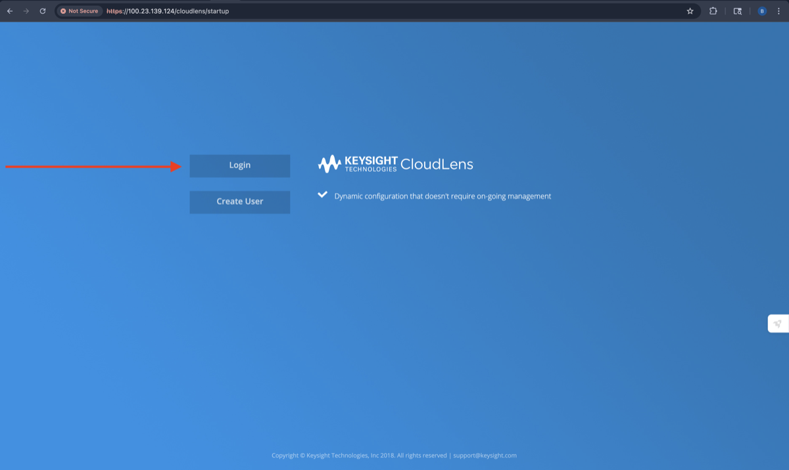

4. Log in with default credentials:

| Field | Value |
|-------|-------|
| **Username** | `admin` |
| **Password** | `Cl0udLens@dm!n` |

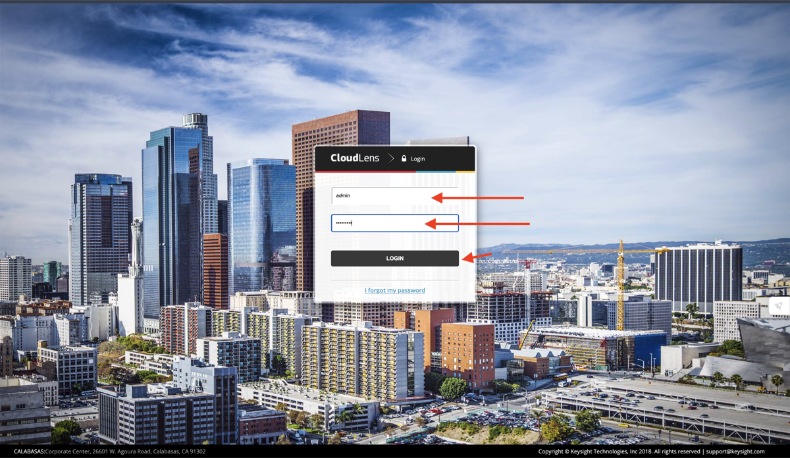

5. **Change the default password immediately** when prompted

---

## 3.2 Create KVO User on CLMS

This allows KVO to communicate with CLMS.

1. Log in to CLMS at `https://<CLMS_IP>`
2. On first login, a **"Create KVO User"** dialog appears
3. Create a username and password (e.g., `b@kvo.com` / `YourPassword123`)
4. Save these credentials — you'll use them in the next step

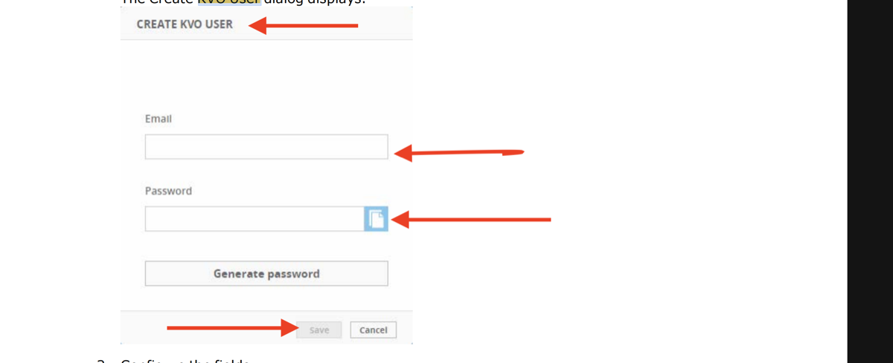

After creating the user, you'll see it in the User Management page:

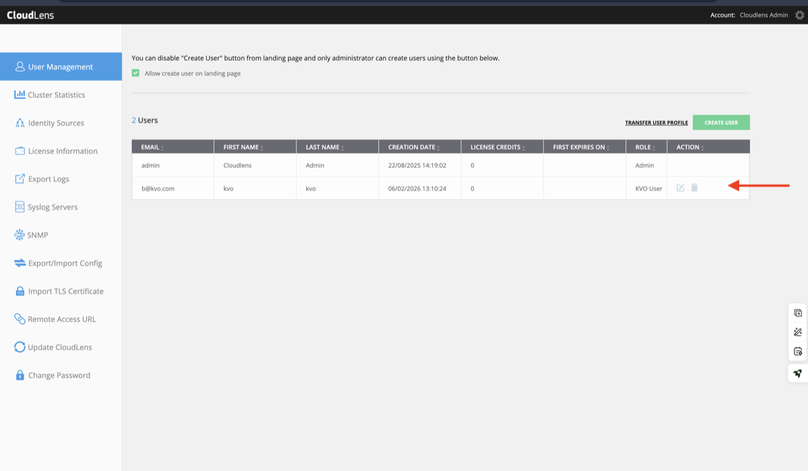

---

## 3.3 Log In to KVO (Keysight Vision One)

1. Open: `https://<KVO_IP>`
2. Accept the self-signed certificate warning
3. Log in:

| Field | Value |
|-------|-------|
| **Username** | `admin` |
| **Password** | `admin` |

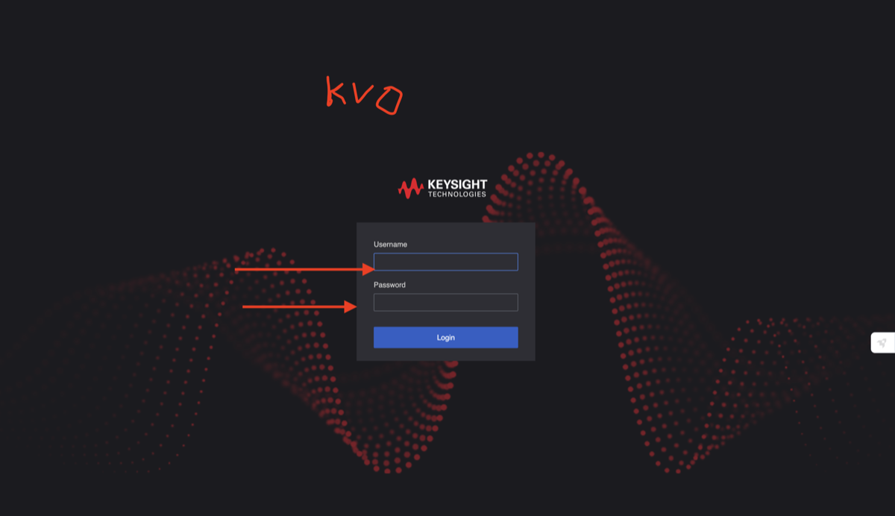

4. **Change the default password** when prompted

---

## 3.4 Register CLMS in KVO Inventory

1. In KVO, go to **Inventory** in the left sidebar
2. Click the **CloudLens Manager** tab
3. Click **Discover CloudLens Manager**
4. Enter:
   - **Name:** Give it a name (e.g., `OpenShift_Lab_CLMS`)
   - **Hostname / IP:** `<CLMS_PRIVATE_IP>` (from `terraform output clms_private_ip`)
   - **Username:** the KVO user created in step 3.2
   - **Password:** the KVO password created in step 3.2
5. Click **Ok**

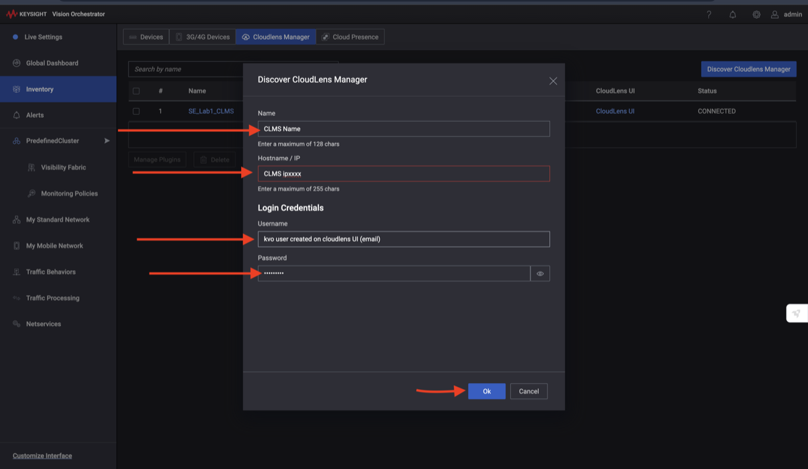

After successful registration, you'll see the CLMS with **CONNECTED** status:

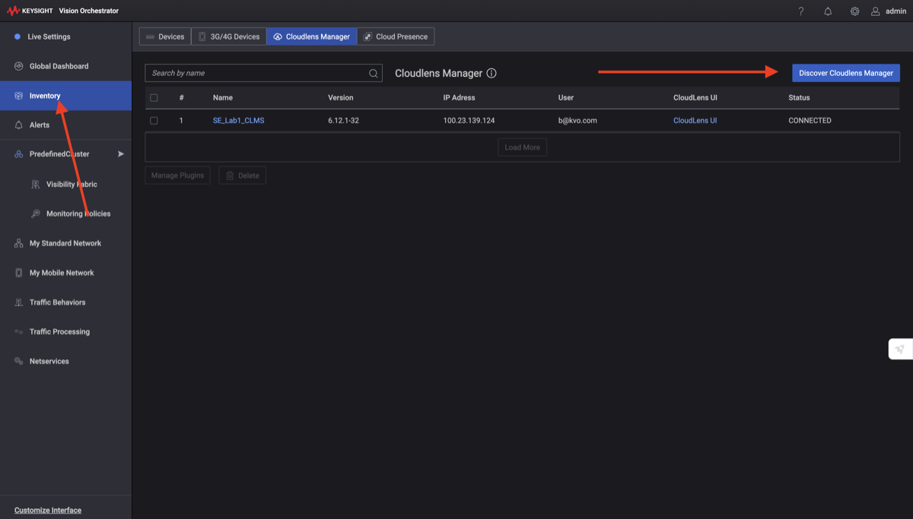

---

## 3.5 Activate Licenses

License keys are required for KVO, CLMS, and vPB. Contact your Keysight representative to obtain activation codes.

### Activate in KVO

1. In KVO, navigate to the top menu bar and click **PRODUCT LICENSING**
2. Click **Activate licenses** on the left
3. In the **"Enter License Data"** field, paste your activation codes (one per line)
4. Click **Load data** to parse the codes
5. Review the products and quantities, then click **Activate**

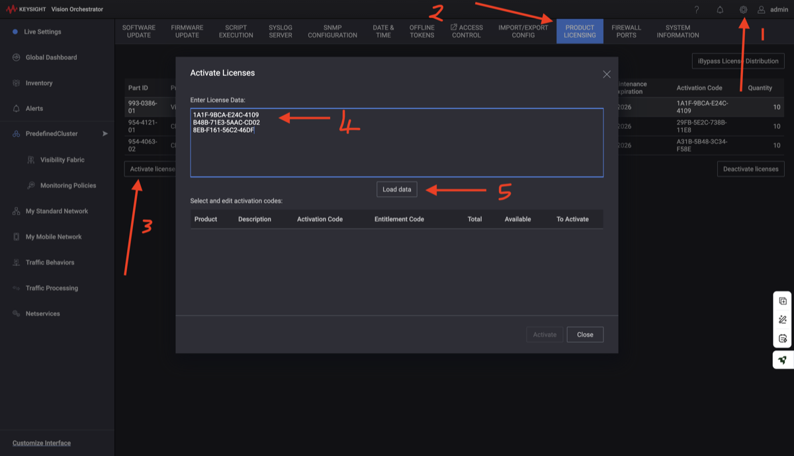

After loading, you'll see the products parsed with their descriptions:

| Product | Description |
|---------|------------|
| **VisionOrchestrator** | KVO perpetual license to manage 10 devices |
| **CloudLens** | CloudLens Enterprise Edition — 1 year subscription |
| **CloudLens** | CloudLens Private Virtual Packet Processing — Advanced |

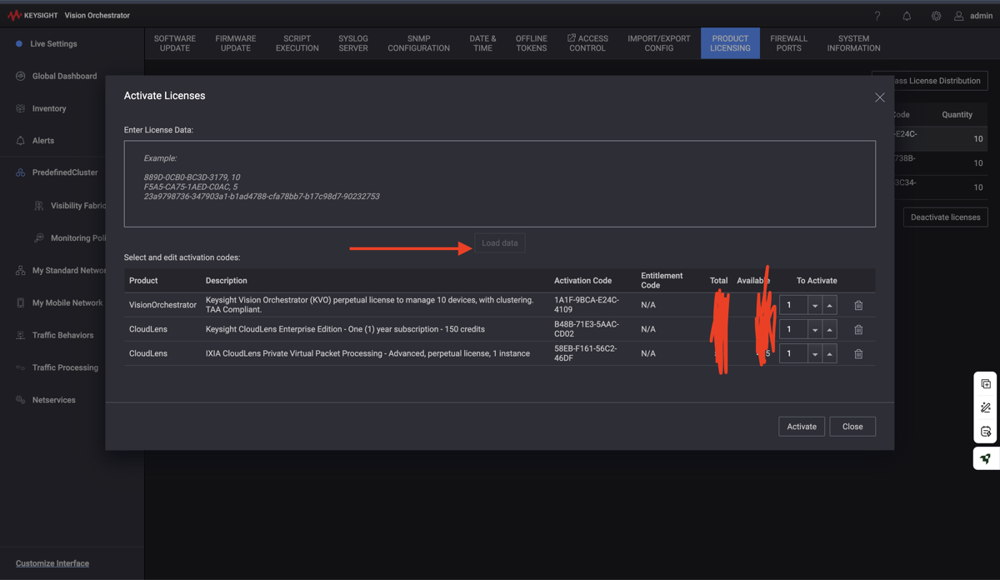

---

## 3.6 Connect to vPB (Virtual Packet Broker)

```bash
# SSH to vPB
ssh admin@<VPB_IP>
# Password: ixia
```

| Field | Value |
|-------|-------|
| **Username** | `admin` |
| **Password** | `ixia` |

The vPB has three network interfaces:

| Interface | Purpose |
|-----------|---------|
| **Management** (eth0) | Admin access — the IP you SSH to |
| **Ingress** (eth1) | Traffic collection from workloads |
| **Egress** (eth2) | Traffic forwarding to monitoring tools |

---

## 3.7 Activate CyPerf License

If you deployed CyPerf (`cyperf_enabled = true`), activate its license. The CyPerf Controller EC2 and OpenShift agent pods are deployed automatically by Terraform — the only manual step is license activation.

### Step 1: Log in to CyPerf Controller

Open the CyPerf Controller UI in your browser:

```
https://<CYPERF_CONTROLLER_PUBLIC_IP>
```

From Terraform: `terraform output -raw cyperf_controller_ui_url`

Log in with:

| Field | Value |
|-------|-------|
| **Username** | `admin` |
| **Password** | `CyPerf&Keysight#1` |

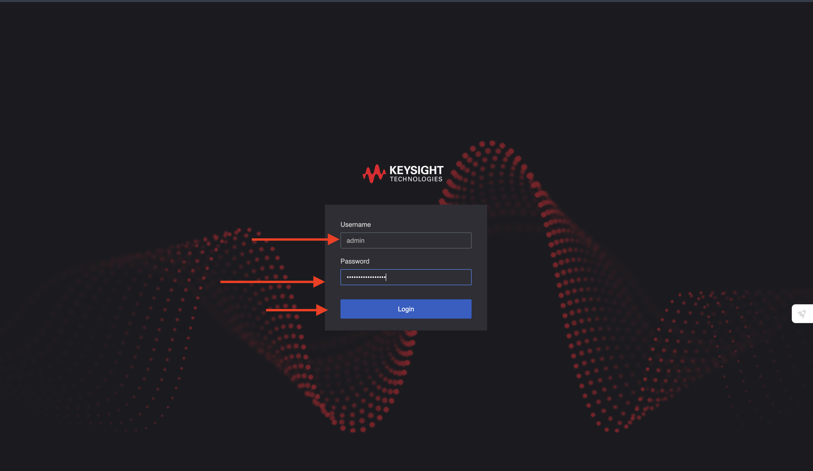

### Step 2: Navigate to License Manager

1. Click the **Settings** gear icon (top-right)
2. Expand **Licensing**
3. Click **License Manager...**

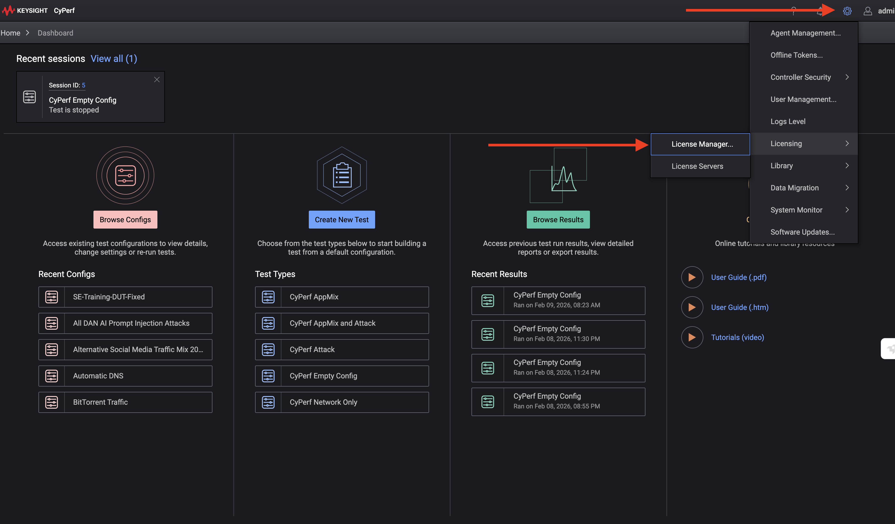

### Step 3: Activate License

1. Click **Activate licenses** on the left
2. In the **"Enter License Data"** field, paste your CyPerf activation codes
3. Click **Load data** to parse the codes
4. Review the products and quantities, then click **Activate**

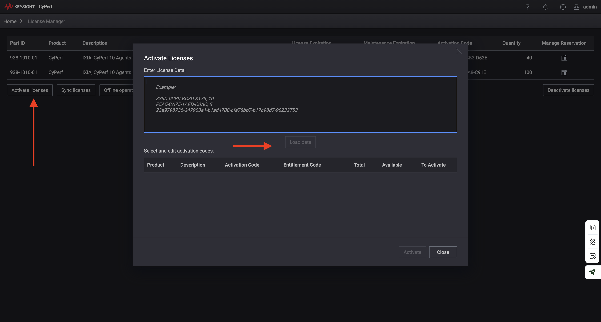

After activation, the CyPerf test session (auto-configured by Terraform via REST API) will be ready to start from the Dashboard.

---

# Part 4: Lab Exercises

## Exercise 1: CloudLens Sensor Sidecar on OpenShift

The CloudLens sensor captures network traffic from pods. On OpenShift, the sensor runs as a **sidecar container** alongside your workload pod. This is the primary deployment model for OpenShift because:

- OpenShift's SCC system requires explicit privilege grants per ServiceAccount
- The sidecar model co-locates the sensor with the specific workload pod
- The sensor gets `platform=openshift` custom tag for visibility segmentation in KVO

> **Note:** A DaemonSet deployment is also possible (see Exercise 5) but requires broader cluster-level privileges.

### Step 1: Create CLMS Project and Get Project Key

1. Log in to CLMS at `https://<CLMS_IP>`
2. Click **Projects** in the left sidebar
3. Click **Create Project**
4. Name it (e.g., `OpenShift Lab`)
5. Click **Generate Key** to create a Project Key
6. **Copy the key** — you'll use it below

### Step 2: Grant Privileged SCC to Sensor ServiceAccount

OpenShift's default SCC (`restricted`) blocks the host-volume access and capabilities the CloudLens sensor needs. Grant the `privileged` SCC explicitly:

```bash
# Create the ServiceAccount (if not already created)
oc create serviceaccount cloudlens-sensor -n default

# Grant privileged SCC — required for:
#   - SYS_MODULE (kernel module loading)
#   - NET_ADMIN / NET_RAW (packet capture)
#   - Host path volumes (/host, /lib/modules, /var/run/crio/crio.sock)
oc adm policy add-scc-to-user privileged -z cloudlens-sensor -n default

# Verify
oc describe scc privileged | grep -A5 "Users:"
```

### Step 3: Deploy nginx-demo with CloudLens Sensor Sidecar

```bash
# Get your CLMS private IP and project key
CLMS_IP=$(terraform output -raw clms_private_ip)
PROJECT_KEY="<YOUR_PROJECT_KEY_FROM_CLMS>"
PREFIX=$(terraform output -raw deployment_prefix)

# Apply with substitutions
sed -e "s|REPLACE_WITH_CLMS_PRIVATE_IP|${CLMS_IP}|g" \
    -e "s|REPLACE_WITH_CLMS_PROJECT_KEY|${PROJECT_KEY}|g" \
    -e "s|REPLACE_WITH_DEPLOYMENT_PREFIX|${PREFIX}|g" \
    kubernetes_manifests/nginx-openshift-deployment.yaml | oc apply -f -

# Wait for rollout
oc rollout status deployment/nginx-demo -n default --timeout=180s
```

### Step 4: Verify Sensor Deployment

```bash
# Check pods — each should show 2/2 Ready (nginx + cloudlens-sensor)
oc get pods -n default

# Check sensor container logs
oc logs -n default -l app=nginx-demo -c cloudlens-sensor --tail=20

# Describe a pod to confirm both containers
oc describe pod $(oc get pod -l app=nginx-demo -o name | head -1) -n default
```

Expected output: pods show `2/2 Running`.

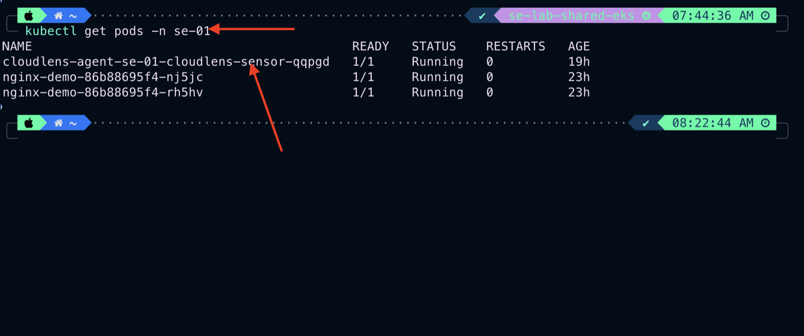

### Step 5: Verify in CLMS

1. Go to CLMS at `https://<CLMS_IP>`
2. Navigate to **Projects > Your Project > Sensors**
3. You should see your ROSA worker nodes listed as active sensors with the `platform=openshift` tag

---

## Exercise 2: KVO Visibility Configuration

Configure KVO to tap traffic from OpenShift pods and forward it to your tool VMs for analysis.

### Step 1: Create a Kubernetes Cloud Config

1. In KVO, go to **Visibility Fabric > Cloud Configs**
2. Click **New Cloud Config** and select **Kubernetes Cluster**

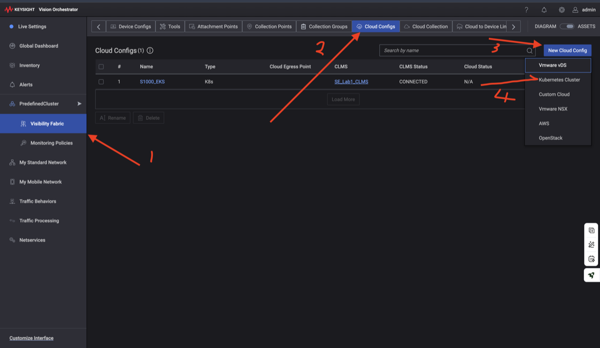

3. Configure:
   - **Name:** `OpenShift` (or any name you prefer)
   - **CloudLens Manager:** select `OpenShift_Lab_CLMS` from the dropdown
   - **Sensor Access Key:** auto-generated
4. Click **Ok**

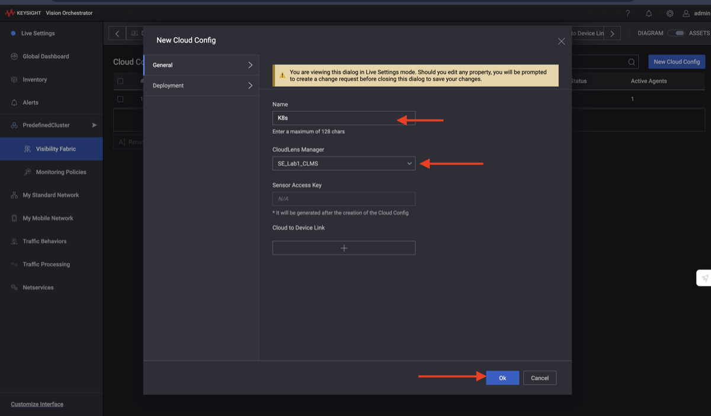

5. **Commit** the change request by clicking the **Commit** button at the top

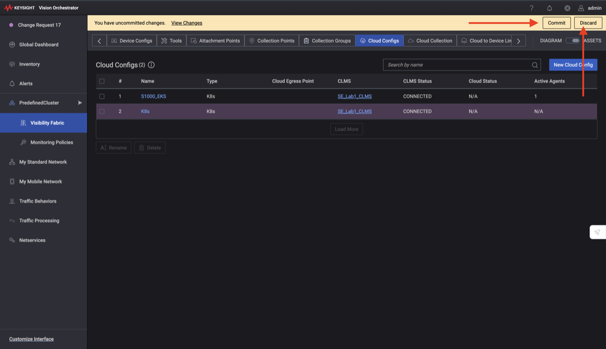

### Step 2: Create a Cloud Collection

1. In KVO, go to **Visibility Fabric > Cloud Collection**

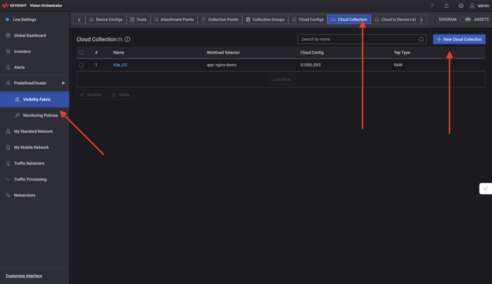

2. Click **New Cloud Collection**
3. Select your Kubernetes Cloud Config (`OpenShift`)
4. Use **Workload Selectors** to choose which pods to tap:
   - Select by **app label:** `nginx-demo`
   - Or select by **Namespace:** `default`

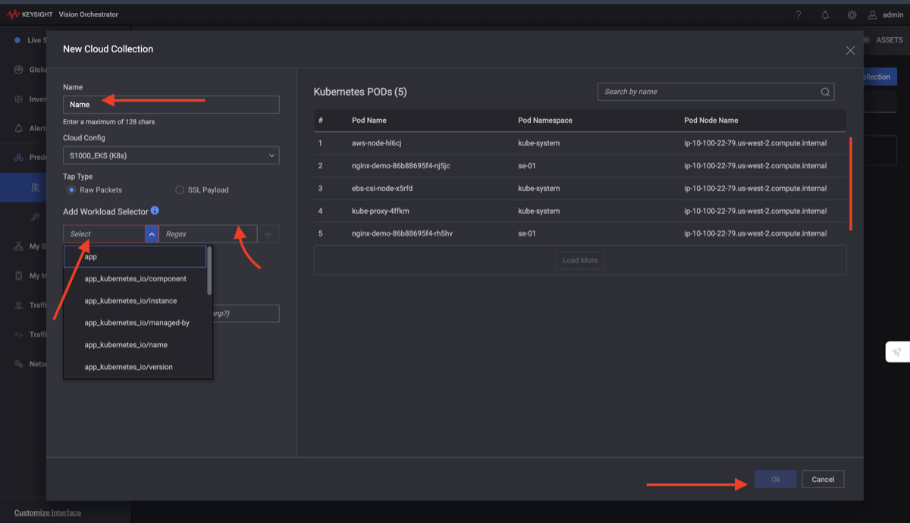

5. Click **Ok** and **Commit**

### Step 3: Create Remote Tools

Define your tool VM destinations before creating a monitoring policy.

1. In KVO, go to **Visibility Fabric > Tools**

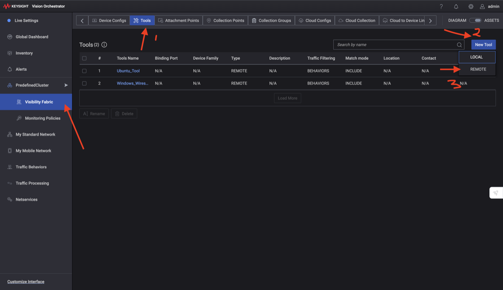

2. Click **New Tool > REMOTE**
3. On the **General** tab, set the tool name (e.g., `Ubuntu_Tool`)

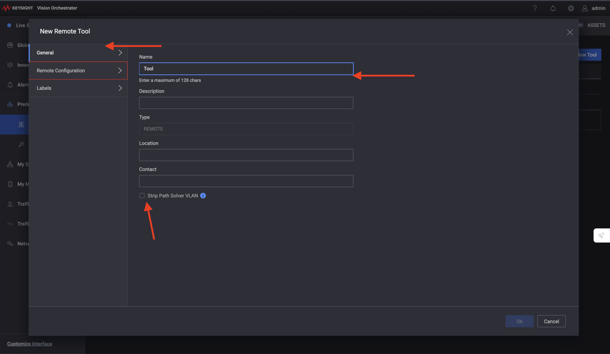

4. On the **Remote Configuration** tab:
   - **Traffic Source:** select **"Traffic source is a cloud"**
   - **Encapsulation Protocol:** `VxLAN`
   - **Remote IP:** `<TOOL_VM_PRIVATE_IP>` (use the **private IP**, not public)
   - **VnID:** any value (e.g., `234`)
   - **UDP Destination Port:** `4789`


5. Click **Ok** and repeat for the Windows Tool VM

### Step 4: Create a Monitoring Policy

1. In KVO, go to **Monitoring Policies**
2. Click **Create New**
3. Configure:
   - **Traffic Source:** the Cloud Collection created above
   - **Traffic Destination:** the Remote Tool created above
   - **Run Mode:** Continuously

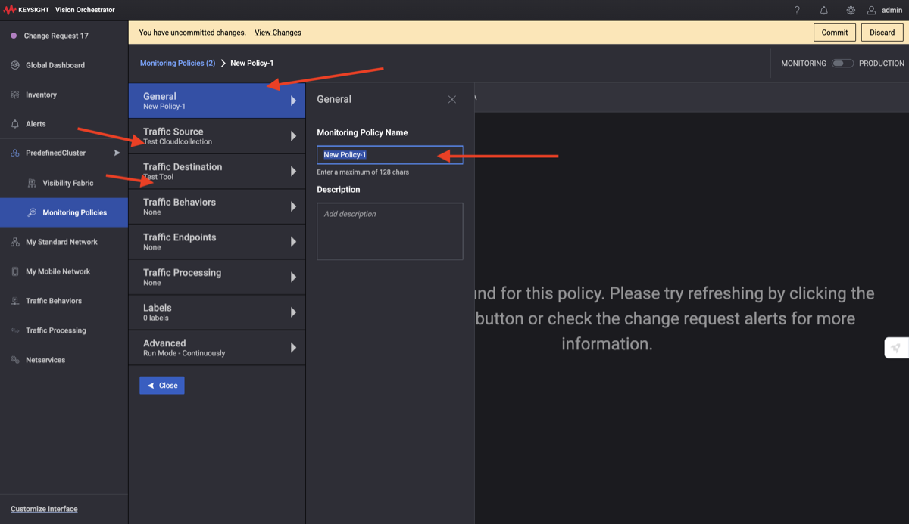

4. **Save and Commit** — click the **Commit** button at the top to apply changes

After committing, view the end-to-end pipeline in the **DIAGRAM** view:

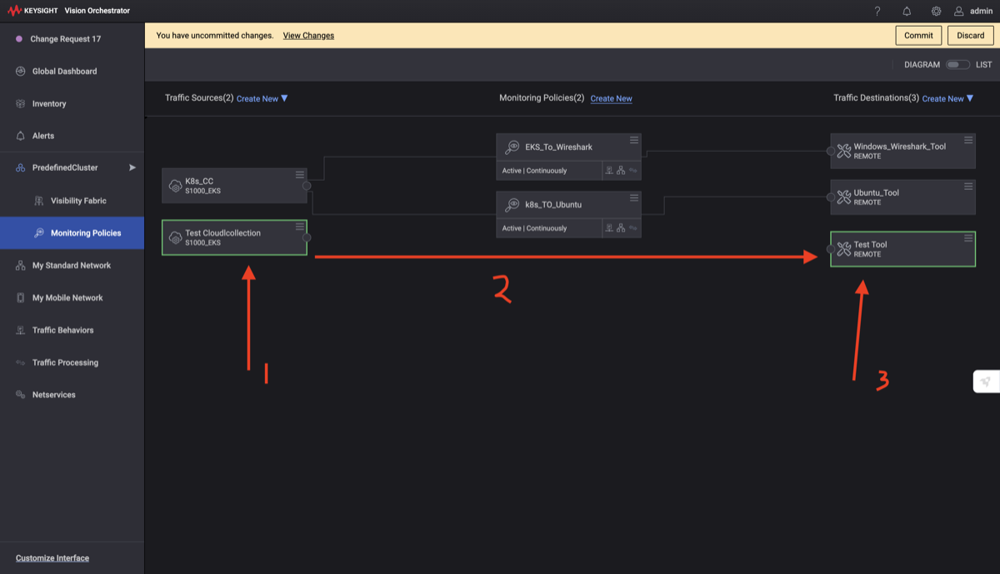

The diagram shows: **Traffic Sources** (Cloud Collections) → **Monitoring Policies** → **Traffic Destinations** (Remote Tools). Each policy runs **Active | Continuously**.

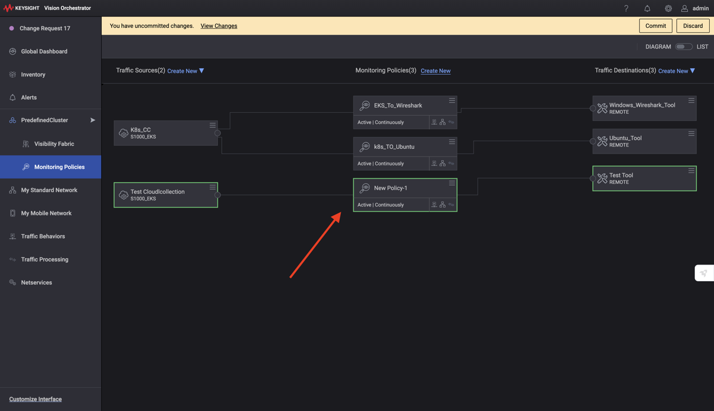

> **Important:** KVO sends mirrored traffic via VXLAN to your tool VM's **private IP** over the VPC network. OVN-Kubernetes (OpenShift's CNI) uses pod CIDR `10.128.0.0/14` — traffic is encapsulated before reaching the VPC, so VXLAN operates at the EC2 host level.

---

## Exercise 3: Verify Mirrored Traffic on Tool VMs

### Option A: Linux Tool VM (tcpdump)

```bash
# SSH to your Linux Tool VM
ssh -i ~/.ssh/cloudlens-lab.pem ubuntu@<TOOL_LINUX_PUBLIC_IP>

# Verify VXLAN packets are arriving (port 4789 = VXLAN)
sudo tcpdump -i ens5 udp port 4789 -nn -c 20 -q

# Filter for specific traffic (e.g., streaming sites from CyPerf)
sudo tcpdump -i ens5 udp port 4789 -nn -A | grep -iE 'netflix|youtube|openai'

# Capture to file for Wireshark analysis
sudo tcpdump -i ens5 udp port 4789 -nn -w ~/captures/openshift-traffic.pcap -c 1000
```

Expected output: UDP packets on port 4789 containing mirrored traffic from your OpenShift pods.

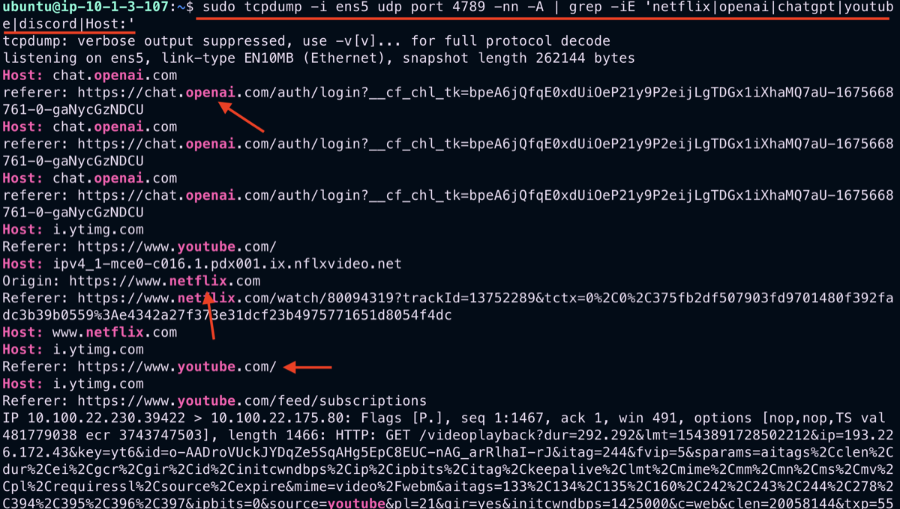

### Option B: Windows Tool VM (Wireshark)

1. Open an RDP client and connect to `<TOOL_WINDOWS_PUBLIC_IP>:3389`
   - **Username:** `Administrator`
   - **Password:** `CloudLens2024!`
2. Open **Wireshark** (desktop shortcut)
3. Start capture on the **Ethernet** interface
4. Apply display filters:

```
# All VXLAN traffic (mirrored from CloudLens)
vxlan

# HTTP traffic inside VXLAN
vxlan && http

# Specific HTTP hosts
http.host contains "nginx"
```

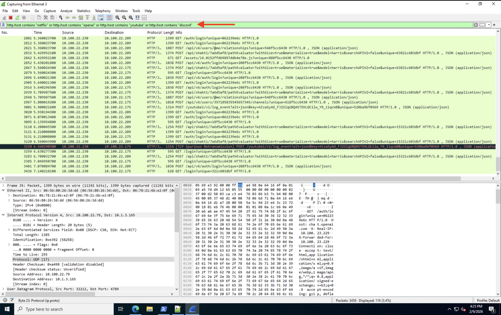

> **Tip:** Expand the **Virtual eXtensible Local Area Network** layer in packet details to see the VXLAN VNI, then expand the inner layers to see the original HTTP traffic from your OpenShift pods.

---

## Exercise 4: vPB Traffic Forwarding

Configure the Virtual Packet Broker to forward traffic between its ingress and egress ports.

### Step 1: SSH to vPB

```bash
ssh admin@<VPB_PUBLIC_IP>
# Password: ixia
```

### Step 2: Configure Port Forwarding

```
configure
set port-forward rule 1 source port eth1 destination port eth2
commit
exit
```

This forwards all traffic arriving on the **ingress** interface (eth1) to the **egress** interface (eth2).

### Step 3: Verify

On the Linux Tool VM:
```bash
sudo tcpdump -i any -n -c 20
```

You should see forwarded traffic arriving from the vPB.

---

## Exercise 5: CyPerf Traffic Generation (Advanced)

CyPerf generates realistic L4-7 application traffic (HTTP, Netflix, YouTube, ChatGPT, Discord) through your OpenShift cluster, giving CloudLens meaningful traffic to capture.

### Architecture

```
CyPerf Client Pod  →  cyperf-proxy (bitnami/nginx)  →  nginx-demo pods
  (namespace: cyperf)   (DUT target, port 8080)          (CloudLens taps here)
```

The `cyperf-proxy` pod acts as the **Device Under Test (DUT)** — CyPerf sends traffic to it, and it proxies requests to the real nginx-demo pods that have CloudLens sensors.

### Step 1: Ensure License is Activated

Activate the CyPerf license before deploying agents (see [Section 3.7](#37-activate-cyperf-license)).

### Step 2: Deploy CyPerf OpenShift Agents

Terraform auto-deploys CyPerf agents after `terraform apply` if `cyperf_enabled = true`. To deploy manually or re-deploy:

```bash
./scripts/deploy-cyperf-openshift.sh
```

This script:
1. Logs in to ROSA via `oc login`
2. Creates the `cyperf` namespace + `cyperf-agent` ServiceAccount
3. Grants `privileged` SCC to the ServiceAccount
4. Deploys `cyperf-proxy` (bitnami/nginx routing to nginx-demo)
5. Deploys `cyperf-agent-client` and `cyperf-agent-server` pods
6. Waits for agents to register with the CyPerf Controller
7. Configures a test session via REST API

### Step 3: Verify Agent Pods

```bash
# Check CyPerf pods
oc get pods -n cyperf -o wide

# Check agent logs
oc logs cyperf-agent-client -n cyperf --tail=30
oc logs cyperf-agent-server -n cyperf --tail=30

# Verify agents registered in controller
# Open https://<CYPERF_CONTROLLER_PUBLIC_IP> > Agents
```

### Step 4: Start the Test

1. Open the CyPerf Controller UI: `terraform output -raw cyperf_controller_ui_url`
2. Log in: `admin / CyPerf&Keysight#1`
3. Navigate to the test session: **"CloudLens OpenShift Lab - CyPerf DUT Mode"**
4. Click **Start**

### Step 5: Monitor Traffic in CloudLens

While the test runs, verify traffic appears in CloudLens:

```bash
# Watch nginx-demo logs — you should see HTTP requests from CyPerf
oc logs -f -l app=nginx-demo -n default | grep -v kube-probe

# Check VXLAN traffic arriving at tool VM
ssh -i ~/.ssh/cloudlens-lab.pem ubuntu@<TOOL_LINUX_PUBLIC_IP>
sudo tcpdump -i ens5 udp port 4789 -nn -A | grep -iE 'netflix|youtube|chatgpt|discord'
```

### Step 6: Configure Test Manually (Optional)

```bash
# Re-configure or create a new test session
./scripts/configure-cyperf-test.sh $(terraform output -raw cyperf_controller_public_ip)
```

---

# Part 5: Reference

## Troubleshooting

### Cannot access CLMS/KVO UI
- **Wait 15 minutes** after deployment for initialization
- Check security group allows your IP (update `allowed_https_cidr` in `terraform.tfvars`)
- Verify instance is running: `aws ec2 describe-instance-status --profile cloudlens-lab`

### SSH connection refused
- Verify key permissions: `chmod 400 ~/.ssh/cloudlens-lab.pem`
- Check instance is running
- Correct usernames: `ubuntu` (Ubuntu/Tool VMs), `admin` (vPB), `ec2-user` (RHEL)

### oc login fails after terraform apply

The htpasswd identity provider takes a few minutes to become active after cluster creation:

```bash
# Check cluster status
rosa describe cluster -c $(terraform output -raw rosa_cluster_name)

# Check the IDP is ready
oc get oauth cluster -o yaml | grep -A5 htpasswd

# Wait and retry
eval "$(terraform output -raw rosa_login_command)"
```

### ROSA cluster stuck in "installing" state

```bash
# Check cluster events
rosa logs install -c $(terraform output -raw rosa_cluster_name) --tail 50

# Verify account roles exist
rosa list account-roles | grep HCP-ROSA

# Re-create if missing
rosa create account-roles --hosted-cp --mode auto --yes --region us-west-2
```

### CyPerf agent CrashLoopBackOff

OpenShift blocks privileged containers without explicit SCC grant:

```bash
# Check the error
oc describe pod cyperf-agent-client -n cyperf | grep -A10 Events

# Re-apply the SCC grant
oc adm policy add-scc-to-user privileged -z cyperf-agent -n cyperf

# Restart the pods
oc delete pod cyperf-agent-client cyperf-agent-server -n cyperf
```

### nginx-demo pod ImagePullBackOff or Permission denied

Standard `nginx:latest` runs as root and will fail on OpenShift. Verify `bitnami/nginx` is used:

```bash
oc get deployment nginx-demo -n default \
  -o jsonpath='{.spec.template.spec.containers[0].image}'
# Should show: bitnami/nginx:latest
```

### CloudLens sensor not starting (SCC error)

```bash
# Check the sensor container specifically
oc describe pod -l app=nginx-demo -n default | grep -A5 "cloudlens-sensor"

# Ensure the ServiceAccount has the SCC
oc adm policy add-scc-to-user privileged -z cloudlens-sensor -n default

# Restart the deployment
oc rollout restart deployment/nginx-demo -n default
```

### No VXLAN traffic on Tool VM
- Verify the Monitoring Policy is **committed** in KVO
- Check that the Cloud Collection has active workload matches
- Ensure tool VM **private IP** is used (not public) in the Monitoring Policy
- Verify security group allows UDP 4789 from ROSA worker subnets
- Check ROSA worker node subnets can reach the tool VM (both are in the same VPC)

### Terraform destroy fails (ROSA)

If operator roles weren't deleted:

```bash
CLUSTER=$(terraform output -raw rosa_cluster_name)
rosa delete operator-roles --cluster "$CLUSTER" --mode auto --yes
rosa delete oidc-provider --cluster "$CLUSTER" --mode auto --yes
terraform destroy
```

---

## Cost Management

Stop all lab resources when not in use:

```bash
# Stop all EC2 instances + scale ROSA workers to 0
./scripts/stop-all.sh

# Start everything back up
./scripts/start-all.sh
```

**Approximate costs:**

| Component | Instance Type | Cost/hr |
|-----------|--------------|---------|
| ROSA HCP control plane | Managed by Red Hat | ~$0.03/hr (always on) |
| ROSA worker nodes (2×) | m5.xlarge | ~$0.38/hr |
| CLMS | t3.large | ~$0.08/hr |
| KVO | t3.large | ~$0.08/hr |
| vPB | t3.xlarge | ~$0.17/hr |
| CyPerf Controller | t3.xlarge | ~$0.17/hr |
| Workload VMs (3×) | t3.medium | ~$0.12/hr |
| Tool VMs (2×) | t3.medium | ~$0.08/hr |
| **Total (approx.)** | | **~$1.10/hr** |

> **ROSA note:** The ROSA HCP control plane (~$0.03/hr) cannot be paused — it runs even when worker nodes are scaled to 0. Use `./scripts/destroy.sh` if you won't need the lab for more than a few days.

---

## Uninstall / Cleanup

### Remove workloads from OpenShift

```bash
# Remove nginx-demo
oc delete deployment,service,route,configmap -l app=nginx-demo -n default
oc delete serviceaccount cloudlens-sensor -n default

# Remove CyPerf namespace
oc delete namespace cyperf
```

### Destroy all AWS resources

```bash
./scripts/destroy.sh
```

Or manually:

```bash
cd terraform

# Preview what will be destroyed
terraform plan -destroy

# Destroy everything
terraform destroy
```

> **Warning:** This permanently deletes all resources including CLMS, KVO, vPB, the ROSA cluster, and the VPC. ROSA operator roles are cluster-specific and will be deleted. Account roles (`HCP-ROSA-*`) are shared and will prompt before deletion.

---

## Lab Environment Summary

After deployment, your lab contains:

| Resource | Purpose | Access |
|----------|---------|--------|
| **CLMS** | CloudLens Manager — sensor management | `https://<CLMS_IP>` (admin / Cl0udLens@dm!n) |
| **KVO** | Vision One — visibility orchestration | `https://<KVO_IP>` (admin / admin) |
| **vPB** | Virtual Packet Broker — traffic forwarding | `ssh admin@<VPB_IP>` (admin / ixia) |
| **CyPerf** | L4-7 traffic generator | `https://<CYPERF_IP>` (admin / CyPerf&Keysight#1) |
| **Ubuntu VM** | Tapped Linux workload | `ssh -i <key> ubuntu@<UBUNTU_IP>` |
| **Windows VM** | Tapped Windows workload | RDP to `<WINDOWS_IP>` (Administrator / CloudLens2024!) |
| **Linux Tool VM** | Traffic analysis (tcpdump) | `ssh -i <key> ubuntu@<TOOL_LINUX_IP>` |
| **Windows Tool VM** | Traffic analysis (Wireshark) | RDP to `<TOOL_WINDOWS_IP>` (Administrator / CloudLens2024!) |
| **ROSA Cluster** | OpenShift workloads + CloudLens sensors | `oc login` via `terraform output rosa_login_command` |
| **nginx-demo** | Sample workload with CloudLens sensor sidecar | OpenShift Route: `oc get route nginx-demo -n default` |

> Run `terraform output` at any time to see all IPs, URLs, and access details.

---

## SSH Quick Reference

```bash
# Set your key path
KEY=~/.ssh/cloudlens-lab.pem

# Linux Tool VM (traffic analysis)
ssh -i $KEY ubuntu@<TOOL_LINUX_IP>

# Ubuntu Workload VM
ssh -i $KEY ubuntu@<UBUNTU_IP>

# vPB (password: ixia)
ssh admin@<VPB_IP>

# Windows Tool VM - use RDP client
open rdp://Administrator@<TOOL_WINDOWS_IP>
```

**OpenShift Quick Reference:**

```bash
# Login
eval "$(terraform output -raw rosa_login_command)"

# Cluster status
rosa describe cluster -c $(terraform output -raw rosa_cluster_name)
oc get nodes
oc get pods --all-namespaces

# nginx-demo
oc get pods -n default
oc get route nginx-demo -n default
oc logs -f -l app=nginx-demo -n default -c cloudlens-sensor

# CyPerf agents
oc get pods -n cyperf -o wide
oc logs cyperf-agent-client -n cyperf --tail=30

# Namespaces overview
oc get projects
```

---

*This guide is for the [cloudlens-openshift-lab](https://github.com/Keysight-Tech/cloudlens-openshift-lab) repository. For the EKS version, see [cloudlens-k8s-lab](https://github.com/Keysight-Tech/cloudlens-k8s-lab). For questions or issues, contact your Keysight representative.*
